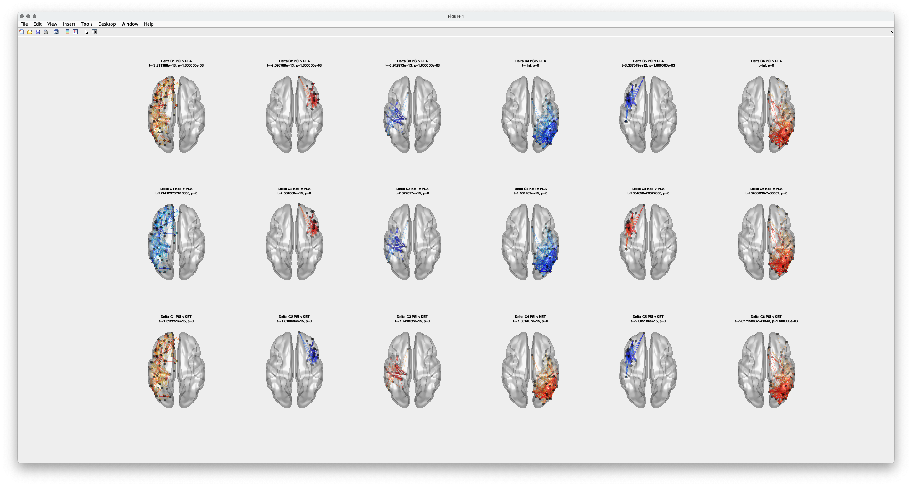

# aconnectivity
 just another connectivity toolbox

This toolbox has functions for fitting multivariate general linear models to group-level functional connectivity using a design matrix. Instead of doing this across every pair of edges in a network, it uses NNMF to factorise a full network into K-subnetworks, and then further refines each of these subnetworks to a network of "only-interconnected-regions". This is done by finding the hub of each subnetwork (node with highest node degree) and then searching all connected component to this node. The result is a set of guaranteed interconnected discrete networks.

